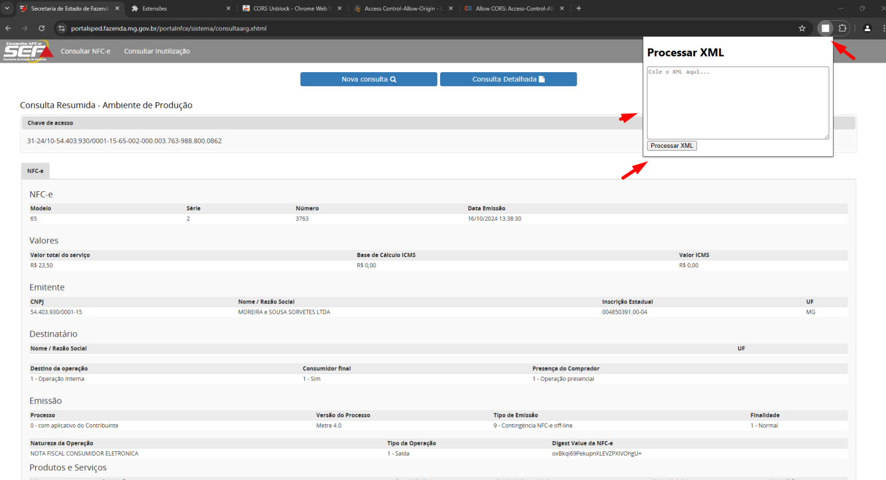
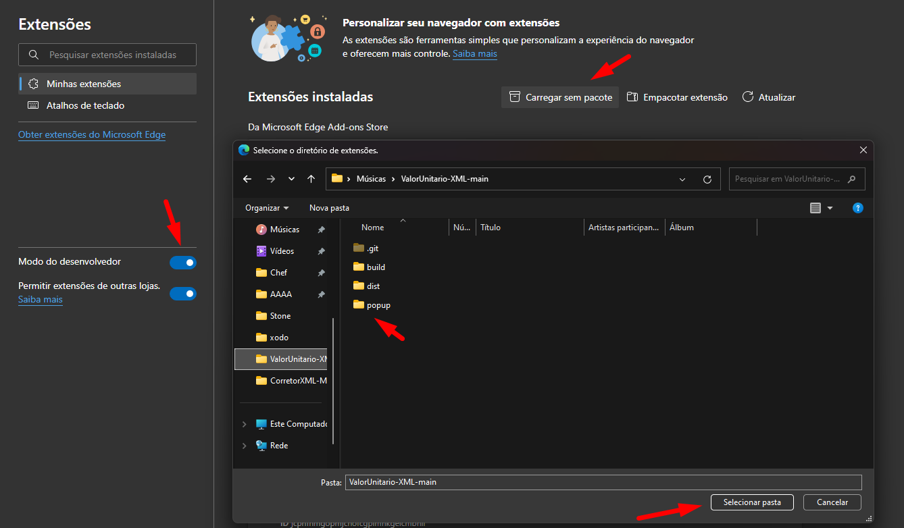

# CrawlerNFCe_Sefaz
Extensão com Crawler para assinatura do XML utilizando os dados em tela da NFCe do XML

Extensão de Navegador pra vocês na qual auxiliará a reassinar/assinar os protocolos de autorização de um XML com base na consulta NFC-e da Sefaz.

*Para utilizar a ferramenta siga os passos:*

1* Extraia o zip (em anexo) em uma pasta no seu computador.
2* Abra o Gerenciador de Extensões do seu navegador.
3* Ative o 'Modo de Desenvolvedor'
4* Clique em 'Carregar sem pacote'
5* Selecione a pasta que você extraiu os arquivos.

Com isto você terá a extensão disponível na qual deverá ser utilizada no site da Consulta NFCe (Após buscar a nota pela chave de acesso) com os dados da nota em Tela.

*Oque o Processar XML vai fazer?*

Ele irá ajustar o XML que não estiver autorizado (enviNFe) por completo e montando o protocolo de autorização com base nas informações que estão em tela (Consulta NFCe).

Exemplo de Informações que irá montar:

<protNFe versao="4.00">
        <infProt Id="ID131244334981277">
            <tpAmb>1</tpAmb>
            <verAplic>W-1.5.43</verAplic>
            <chNFe>31241054403930000115650020000037639888000862</chNFe>
            <dhRecbto>2024-10-16T13:58:31-03:00</dhRecbto>
            <nProt>131244334981277</nProt>
            <digVal>oxBkqi69PekupnXLEVZPXIVOhgU=</digVal>
            <cStat>100</cStat>
            <xMotivo>Autorizado o uso da NF-e</xMotivo>
        </infProt>
    </protNFe>

Caso já tenha as tags, ou seja, o Xml já esteja autorizado e com as tags de autorização... Ele irá reprocessar as informações com base noque estiver em tela (Substituir os dados, como Chave de acesso, protocolo etc etc).

Obs: Serve para todos os navegadores até então! (Chrome, Edge, Opera etc) 

